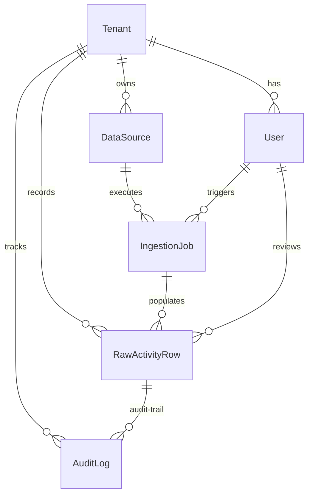

# Data Model & Architecture Design

This document details the database schema, multi-tenancy implementation, and emission calculation architectures designed for the **Breathe ESG Data Ingestion Platform**.

---

## 1. Django Models Reference & Field-Level Rationale

The schema consists of seven tables structured to support high-throughput ingestion, analyst auditing, and compliance log trails.

### A. Tenant
Represents the organizational boundaries.
* `id`: Auto-incrementing primary key.
* `name`: CharField. Human-readable enterprise name.
* `slug`: SlugField (unique). System identifier used in subdomain or routing context.
* `created_at`: DateTimeField. Tracks registration dates.

### B. User
Extends Django's `AbstractUser` to associate analyst accounts directly with an organization.
* `tenant`: ForeignKey -> Tenant (nullable for global superusers, cascade on delete). Ensures every active session is tied to a workspace.

### C. DataSource
Specifies an active data stream configurations.
* `tenant`: ForeignKey -> Tenant.
* `source_type`: CharField. Choices: `SAP_FUEL`, `SAP_PROCUREMENT`, `UTILITY_ELECTRICITY`, `TRAVEL_FLIGHT`, `TRAVEL_HOTEL`, `TRAVEL_GROUND`. Defines the classification schema.
* `ingestion_mode`: CharField. Choices: `FILE_UPLOAD`, `API_PULL`.
* `config`: JSONField. Preserves dynamic lookup parameters (e.g. mapping dictionaries like `plant_mapping` for Werk to Location resolution).

### D. IngestionJob
Logs execution cycles for file uploads.
* `data_source`: ForeignKey -> DataSource.
* `status`: CharField. Choices: `PENDING`, `PROCESSING`, `COMPLETED`, `FAILED`.
* `raw_file`: FileField. Preserves the original file upload payload for audit replay.
* `row_count` / `error_count`: IntegerFields. Basic validation metrics.
* `error_log`: JSONField. Array of structures documenting parser faults.
* `triggered_by`: ForeignKey -> User. Captures the actor initiating the load.

### E. RawActivityRow
The core staging table. Holds transaction logs and calculation metrics.
* `id`: UUID (Primary Key). Secure, non-sequential reference.
* `tenant`: ForeignKey -> Tenant. Enables direct row-level separation.
* `ingestion_job`: ForeignKey -> IngestionJob. Connects back to the load history.
* `source_type` / `scope`: CharFields. Track carbon reporting boundaries.
* `raw_data`: JSONField. Unstructured original row from the source CSV/XLSX file. Keeps the raw truth intact.
* `parsed_quantity` / `parsed_unit`: Decimal / CharField. Standardized extract from input.
* `normalized_quantity_kwh` / `normalized_quantity_kg_co2e`: DecimalFields. Calculation outputs. **Left null until analyst approval** to mark audit stages.
* `activity_date`: DateField. Transaction date (posting date, mid-point date, expense date).
* `period_start` / `period_end`: DateFields. Used for utility billing windows.
* `location` / `description`: Location name and description string.
* `emission_factor_used` / `emission_factor_source`: Tracks exactly what factor was computed and the dataset year/source (e.g., "DEFRA 2023").
* `status`: Choices: `PENDING_REVIEW`, `FLAGGED`, `APPROVED`, `REJECTED`.
* `flag_reasons`: JSONField. Lists auto-flag messages (e.g. "Negative quantity").
* `is_locked`: BooleanField. Set to `True` when exported, blocking edits.
* `edited_from_raw`: BooleanField. Set to `True` if any staging values are modified by the analyst.

### F. AuditLog
Enforces ISO compliance tracking.
* `tenant` / `row`: ForeignKeys to Tenant and RawActivityRow.
* `action`: Choices: `CREATED`, `EDITED`, `APPROVED`, `REJECTED`, `LOCKED`.
* `performed_by`: ForeignKey -> User.
* `before_state` / `after_state`: JSONFields documenting state diffs.

### G. UnitConversion
Static conversion multipliers.
* `from_unit` / `to_unit`: Unit types.
* `factor`: Decimal multiplier.

### H. EmissionFactor
Stores ESG datasets.
* `activity_type`, `region`, `unit`, `factor_kg_co2e_per_unit`, `source`, `valid_year`.

---

## 2. Multi-Tenancy Architecture

Multi-tenancy is implemented using **Row-Level Foreign Key Isolation** rather than **Schema-Separation** or **Database-Separation**:
* **Mechanism**: Every table (except helper lists `UnitConversion` and `EmissionFactor`) carries a `tenant` ForeignKey. All API views automatically query `.filter(tenant=request.user.tenant)` derived from the validated JWT token.
* **Why**: For ESG mid-market compliance portals, row-level multi-tenancy provides the optimal balance of simple deployment, easy DB migrations, low infrastructure overhead, and easy cross-tenant benchmarking (if allowed). Schema separation adds high operational complexity to SQLite/Postgres connection pooling and slows down migration runtimes.

---

## 3. Scope 1/2/3 Categorization Logic

Categorization maps directly to carbon reporting boundaries:
* **Scope 1 (Direct Emissions)**: SAP Fuel imports. Represents direct diesel or petrol combustion in owned assets (e.g., boiler, vehicle fleet).
* **Scope 2 (Indirect Emissions)**: Utility Electricity. Represents electricity bought from grids, where carbon is released by power plants off-site.
* **Scope 3 (Indirect Value Chain)**: SAP Procurement (upstream goods and services) and Corporate Travel (flight, hotel, ground transport in non-owned assets).

---

## 4. Preservation of Source-of-Truth

The platform enforces absolute auditability:
1. **Raw Preservation**: The original file is stored in `IngestionJob.raw_file`, and each row's original CSV/Excel columns are captured intact in `RawActivityRow.raw_data` (JSONField).
2. **Edit Flagging**: If an analyst updates values inside the dashboard, `edited_from_raw` is set to `True`.
3. **State Diffs**: Any update writes a record in `AuditLog` containing the before/after state, satisfying compliance auditors tracking manual data manipulations.

---

## 5. Unit Normalization & Calculation Strategy

Normalizations execute **upon Analyst Approval**, rather than at ingestion or query time:
* **Why**: Running calculations on ingest introduces database lookup loads during file parser loops and complicates dirty data corrections. Query-time calculation causes slow table renders under heavy data volumes. By running calculation on approval, we freeze the values in static columns (`normalized_quantity_kg_co2e`), keeping queries lightning fast and preserving the exact emission factor used at that specific point in time.

---

## 6. Enterprise Scaling Roadmap (Future Enhancements)

If scaling to millions of rows:
1. **Field-Level Encryption**: Encrypt `raw_data` columns using PgCrypto to protect sensitive financial or employee data.
2. **Schema Separation**: Transition to schema-level isolation (e.g. Django Tenants) to isolate database indexes.
3. **Event Sourcing**: Rebuild the audit trail as an immutable append-only event stream (Kafka or AWS Kinesis) where the final ESG state is a fold of events.
