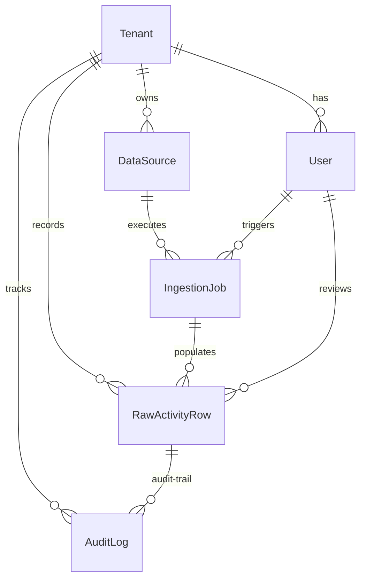

# Data Model & Architecture Design

This document details the database schema, multi-tenancy implementation, and emission calculation architectures designed for the **Breathe ESG Data Ingestion Platform**.

---

## 1. Django Models Reference & Field-Level Rationale

The schema consists of seven tables structured to support high-throughput ingestion, analyst auditing, and compliance log trails.

### A. Tenant
Represents the organizational unit (a company using the platform).
* `id`: Auto-incrementing primary key.
* `name`: CharField. Human-readable enterprise name (e.g. "Acme Corp Ltd").
* `slug`: SlugField (unique). System identifier used in routing context (e.g. `acme-corp`).
* `created_at`: DateTimeField. Tracks when the tenant was onboarded.

### B. User
Extends Django's `AbstractUser` to associate analyst accounts directly with an organization.
* `tenant`: ForeignKey → Tenant (nullable for global superusers, cascade on delete). Ensures every active session is tied to a specific workspace. The JWT token carries the tenant context — all API views derive the current tenant from `request.user.tenant`.

### C. DataSource
Specifies an active data stream configuration per tenant.
* `tenant`: ForeignKey → Tenant.
* `source_type`: CharField. Choices: `SAP_FUEL`, `SAP_PROCUREMENT`, `UTILITY_ELECTRICITY`, `TRAVEL_FLIGHT`, `TRAVEL_HOTEL`, `TRAVEL_GROUND`. Defines the classification schema at source configuration level.
* `ingestion_mode`: CharField. Choices: `FILE_UPLOAD`, `API_PULL`. Currently all sources use `FILE_UPLOAD`.
* `config`: JSONField. Preserves dynamic lookup parameters (e.g. `plant_mapping` dictionary for Werk → Location resolution per client).

### D. IngestionJob
Logs each execution cycle (one file upload = one job).
* `data_source`: ForeignKey → DataSource.
* `status`: CharField. Choices: `PENDING`, `PROCESSING`, `COMPLETED`, `FAILED`.
* `raw_file`: FileField. Preserves the original file upload for audit replay. If a parsing decision is disputed, the raw file can be re-processed.
* `row_count` / `error_count`: IntegerFields. Top-level validation metrics shown to the analyst after upload.
* `error_log`: JSONField. Array of structured objects documenting individual parser faults with row index and error message.
* `triggered_by`: ForeignKey → User. Captures who initiated the ingestion load.

### E. RawActivityRow
The core staging table. Holds every transaction record from all three source types, normalized into a common schema.

* `id`: UUID (Primary Key). Non-sequential, secure reference safe for external sharing with auditors.
* `tenant`: ForeignKey → Tenant. Direct row-level isolation — the single most important field for multi-tenancy. Every query is automatically filtered by this field.
* `ingestion_job`: ForeignKey → IngestionJob. Connects every row back to the exact file upload that created it. Answers: "which batch did this come from?"
* `source_type`: CharField. One of six source choices (SAP_FUEL, SAP_PROCUREMENT, UTILITY_ELECTRICITY, TRAVEL_FLIGHT, TRAVEL_HOTEL, TRAVEL_GROUND). Determines which parser processed it and which emission factor applies.
* `scope`: CharField. SCOPE_1, SCOPE_2, or SCOPE_3. Set by the parser based on source_type. Used for GHG Protocol reporting aggregation.
* `raw_data`: JSONField. **The original row from the source file, unchanged, stored as a dictionary.** This is the source-of-truth. If a bug is found in the parser, `raw_data` can be re-processed. Example for a SAP row: `{"Buchungsdatum": "02.01.2024", "Werk": "1001", "Menge": "1.614,62", "Basismengeneinheit": "L", ...}`.
* `parsed_quantity` / `parsed_unit`: The normalized numeric value and unit extracted from raw_data. For SAP: gallons → stored as gallons initially, then converted on approval. For utility: always kWh or MWh as received.
* `normalized_quantity_kwh`: DecimalField. Populated on analyst approval for electricity rows. Null for non-electricity sources.
* `normalized_quantity_kg_co2e`: DecimalField. Populated on analyst approval for all rows. The final carbon emission value used in reports.
* `activity_date`: DateField. The transaction date. For SAP: Buchungsdatum (posting date). For utility: midpoint of billing period. For travel: expense date.
* `period_start` / `period_end`: DateFields. Used exclusively for utility billing windows to preserve the exact billing interval, since utility periods cross calendar month boundaries.
* `location`: CharField. Plant name for SAP, site name for utility, origin city for travel.
* `description`: TextField. Material description for SAP, meter name for utility, expense description for travel.
* `emission_factor_used` / `emission_factor_source`: The exact numeric factor applied at approval time and its dataset label (e.g., "DEFRA 2023"). Stored so that if DEFRA updates their factors next year, the historical approved value remains traceable.
* `status`: PENDING_REVIEW → FLAGGED / APPROVED / REJECTED. Transitions are one-directional except FLAGGED can be re-approved after analyst edits.
* `flag_reasons`: JSONField (list of strings). Human-readable auto-flag messages such as "Billing period is 38 days (unusual — possible re-bill)" or "Unrecognized unit: XYZ — manual classification required".
* `is_locked`: BooleanField. Set to True on audit export. After locking, PATCH and approve/reject calls return HTTP 400.
* `edited_from_raw`: BooleanField. True if analyst changed parsed_quantity or parsed_unit from their original values. Tracked in AuditLog as EDITED action.
* `reviewed_by` / `reviewed_at` / `reviewer_note`: Who approved/rejected, when, and any note they left.
* `created_at` / `updated_at`: Standard timestamps on every row.

### F. AuditLog
Full compliance trail satisfying ISO 14064 traceability requirements.
* `tenant` / `row`: ForeignKeys to Tenant and RawActivityRow.
* `action`: CREATED, EDITED, APPROVED, REJECTED, LOCKED.
* `performed_by`: ForeignKey → User. Who triggered this action.
* `performed_at`: DateTimeField. Auto-set at creation.
* `before_state` / `after_state`: JSONFields containing actual state diffs — not nulls. For APPROVED: `before_state = {"status": "PENDING_REVIEW"}`, `after_state = {"status": "APPROVED", "normalized_quantity_kg_co2e": "145.23", "emission_factor_used": "2.68"}`. For EDITED: full field values before and after the change.

### G. UnitConversion
Static conversion lookup table. Contains multipliers from one unit to another.
* `from_unit` / `to_unit`: e.g. "gallons" → "liters" with factor 3.78541.
* `factor`: Decimal multiplier.
* `source`: Attribution string (e.g. "Standard Conversion").

All unit conversions in the parsers reference this table via `UnitConversion.objects.get(from_unit=..., to_unit=...)`. No conversion math is hardcoded in parser code.

### H. EmissionFactor
ESG emission dataset rows seeded from DEFRA 2023 and EPA eGRID 2022.
* `activity_type`: e.g. "Diesel", "Short-haul flight", "Hotel stay".
* `region`: "UK", "US", "Global".
* `unit`: The unit the factor applies to (e.g. "liter", "km", "room-night").
* `factor_kg_co2e_per_unit`: The carbon factor.
* `source` / `valid_year`: Provenance for audit traceability.

All emission calculations use `EmissionFactor.objects.get(activity_type=..., region=..., unit=...)`. No emission factors are hardcoded in parser code.

---

## 2. Multi-Tenancy Architecture

Multi-tenancy is implemented using **Row-Level Foreign Key Isolation** rather than Schema-Separation or Database-Separation:

* **Mechanism**: Every table (except shared reference tables `UnitConversion` and `EmissionFactor`) carries a `tenant` ForeignKey. All API views automatically filter `.filter(tenant=request.user.tenant)` derived from the validated JWT token. This makes tenant isolation automatic — there is no code path where an analyst can accidentally see another tenant's data.

* **Why row-level, not schema-per-tenant**: Schema-per-tenant (e.g. django-tenants) requires dynamic database routing, per-tenant migration management, and more complex connection pooling. For a mid-market ESG compliance prototype with fewer than 50 tenants and sub-million row volumes, row-level isolation provides the correct balance of simplicity, maintainability, and query performance.

* **What the isolation means in practice**: Analyst A at Acme Corp logs in → JWT token carries `tenant_id=1` → `GET /api/review/rows/` filters `WHERE tenant_id = 1`. Analyst B at Riverview Ltd with `tenant_id=2` gets a completely separate dataset from the same database.

---

## 3. Scope 1/2/3 Categorization Logic

Categorization follows the GHG Protocol Corporate Standard exactly:

* **Scope 1 (Direct Emissions)**: SAP Fuel imports (`SAP_FUEL` source type). Represents direct combustion of diesel or petrol in owned assets — company vehicles, boilers, generators. The company physically burns the fuel.

* **Scope 2 (Indirect Purchased Energy)**: Utility Electricity (`UTILITY_ELECTRICITY`). Represents electricity bought from the grid. The combustion happens at the power station, not on company premises — it is an indirect emission from purchased energy. GHG Protocol requires this to be separated from Scope 1.

* **Scope 3 (Value Chain Emissions)**: Two sources:
  - `SAP_PROCUREMENT`: Upstream goods (steel, concrete, components purchased from suppliers). The carbon was emitted during manufacturing, not by the company directly.
  - `TRAVEL_FLIGHT`, `TRAVEL_HOTEL`, `TRAVEL_GROUND`: Business travel in non-owned transport assets. Flights and hotels are third-party assets; the carbon from them is a downstream value chain emission.

The scope is set automatically by the parser at ingest time based on source_type. Analysts cannot change the scope field.

---

## 4. Preservation of Source-of-Truth

The platform enforces absolute auditability through four layers:

1. **File-Level Preservation**: The original uploaded file is stored in `IngestionJob.raw_file` (FileField). If a client disputes that their file was parsed correctly, the original file can be retrieved and re-processed.

2. **Row-Level Preservation**: The original row from the source file is stored verbatim in `RawActivityRow.raw_data` (JSONField). For a SAP row, this is: `{"Buchungsdatum": "02.01.2024", "Werk": "1001", "Menge": "1.614,62", "Basismengeneinheit": "L"}`. This is set once at creation and never overwritten.

3. **Edit Flagging**: If an analyst changes `parsed_quantity` or `parsed_unit` through the dashboard, `edited_from_raw` is set to `True`. This flags that the stored value diverges from what the source system sent.

4. **State Diffs in AuditLog**: Every state change — creation, edit, approval, rejection, lock — writes an `AuditLog` entry with `before_state` and `after_state` as JSON diffs. This answers: "what was the value before the analyst changed it, and what did they change it to?"

---

## 5. Unit Normalization & Calculation Strategy

**When normalization happens**: Emission calculations run at **analyst approval time**, not at ingest time or query time.

**Why approval-time, not ingest-time**:
- Running calculations during ingest requires EmissionFactor and UnitConversion lookups inside the parser loop, slowing large file processing significantly.
- More importantly: if the analyst edits `parsed_quantity` or `parsed_unit` before approving (correcting a misread value), the final emission must be calculated from the *edited* value, not the original. Running calculation at approval automatically uses whatever the current state of the row is.

**Why approval-time, not query-time**:
- Query-time calculation would mean re-running the factor lookup on every page load, causing slow render times at scale.
- Approval-time freezes the exact `normalized_quantity_kg_co2e` and `emission_factor_used` values into static columns, meaning historical approved figures are immutable even if the EmissionFactor table is updated next year.

**The normalization pipeline on approval**:
1. Read `parsed_quantity` and `parsed_unit`.
2. If unit requires conversion (e.g. gallons → liters), look up `UnitConversion` table and multiply.
3. Look up `EmissionFactor` table by `activity_type`, `region`, and normalized unit.
4. Multiply converted quantity × factor to get `normalized_quantity_kg_co2e`.
5. For electricity rows, also write `normalized_quantity_kwh`.
6. Store `emission_factor_used` (numeric) and `emission_factor_source` (e.g. "DEFRA 2023") on the row.

---

## 6. What We Would Add With More Time

Given more development time, the following enhancements would make this production-ready:

1. **Celery Async Job Queue**: Currently, file parsing runs synchronously inside the API request cycle. Large SAP exports (10,000+ rows) would cause request timeouts. Production requires Celery workers with Redis or RabbitMQ as a broker — the API endpoint enqueues the job, the worker processes it, and the frontend polls job status.

2. **Field-Level Encryption on `raw_data`**: Raw data from SAP exports may contain employee cost center codes and internal financial references. Production would use PostgreSQL `pgcrypto` to encrypt the `raw_data` column at rest.

3. **Schema-Per-Tenant Multi-Tenancy**: When tenant count grows beyond 100 or data volumes exceed 50M rows, row-level isolation becomes a query performance bottleneck. Migrating to `django-tenants` (schema-per-tenant) would isolate indexes per tenant and allow independent backups.

4. **Market-Based Scope 2 Factors**: Currently only location-based grid factors (national average) are supported. Enterprise clients with renewable energy contracts need market-based factors (their supplier's declared carbon intensity). This requires a `GridContract` model per tenant.

5. **Re-upload Deduplication Logic**: Currently, uploading the same file twice creates duplicate rows. Production requires a fingerprinting mechanism (SHA-256 of row content) to detect and reject duplicates.
